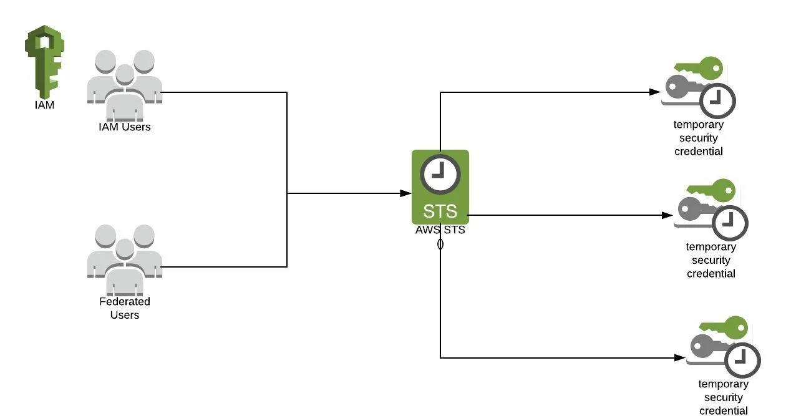
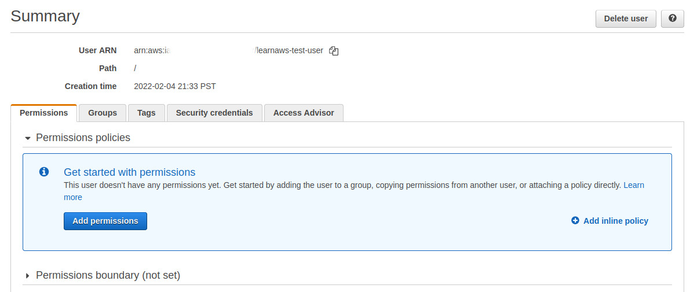
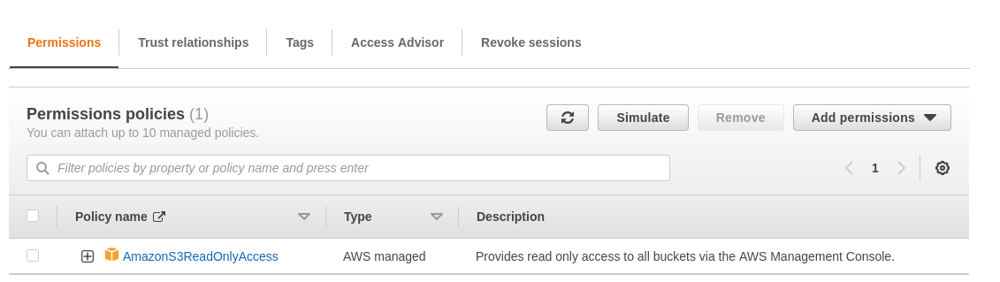

# AWS Security Token Service (STS)

AWS Security Token Service (AWS STS) is the service that you can use to create and provide trusted users with temporary security credentials that can control access to your AWS resources.

**You use STS to provide trusted users with temporary access to resources via API calls, your AWS console or the AWS command line interface (CLI)**

The temporary security credentials work exactly like regular long term security access key credentials allocated to IAM users only the lifecycle of the access credentials is shorter.




### Benefits
* No need to embed token in the code
* Limited Lifetime(15min — 1 and 1/2 day)

## Use Cases

### Identity Federation(Enterprise Identity Federation[Active Directory/ADFS]/ Web Identity Federation (Google, Facebook))

Using AWS STS you can grant access to AWS resources for users that have been authenticated at your enterprise network. **This enterprise identity federation removes the need to create new AWS identities and no new login credentials are required.**

### Cross-account access(For Organization with multiple AWS accounts)

Lots of organisations maintain multiple AWS accounts and can use IAM identities and cross account roles to allow users from one account to access resources in another. Once the permissions are delegated to an IAM user, this trusted relationship can be used to request temporary access via AWS STS temporary credentials.

### Applications on Amazon EC2 Instances

If you have applications running on an EC2 instance that require access to AWS resources, you can create temporary access credentials using AWS STS when the EC2 instance is launched.  

To do that, **the EC2 instance will need to be associated with an IAM role to allow the application to request credentials**. Once the security credentials are granted, they are available to all applications hosted on the EC2 instance so you do not need to store any long-term security credentials in the instance. 


Lets see this in action

### 1. Create an IAM User with no permissions

Lets first create an iam user that has no permissions



We can confirm that this user has no permissions by running the following command:

```text

$ aws s3 ls

An error occurred (AccessDenied) when calling the ListBuckets operation: Access Denied
```


### 2. Create a new IAM role that can be assumed

We will now create a new IAM role that our IAM user will assume. This IAM role has read-only access to all S3 buckets in our account.

To ensure that our IAM user can assume this role, we need to add a Trust policy in the IAM role where the Principal is our IAM user. The trust policy for this IAM role looks something like this:

```text
{
    "Version": "2012-10-17",
    "Statement": [
        {
            "Effect": "Allow",
            "Principal": {
                "AWS": "arn:aws:iam::<account_id>:user/learnaws-test-user""
            },
            "Action": "sts:AssumeRole"
        }
    ]
}
```




### 3. Assume the IAM role

We will assume this new IAM role that we created using the assume-role subcommand in the aws sts command.  
The command returns a set of temporary credentials that will allow us to access AWS resources associated with the IAM Role that we want to assume. These temporary credentials consist of an access key ID, a secret access key, and a security token.

The arguments for this command are:
 * role-arn: ARN for the IAM role we want to assume
 * role-session-name: Name for session to uniquely identify

```text
export ROLE_ARN=<role_arn>
export $(printf "AWS_ACCESS_KEY_ID=%s AWS_SECRET_ACCESS_KEY=%s AWS_SESSION_TOKEN=%s" \
$(aws sts assume-role \
--role-arn $ROLE_ARN \
--role-session-name MySessionName \
--query "Credentials.[AccessKeyId,SecretAccessKey,SessionToken]" \
--output text))
```

or 

```text
export ROLE_ARN=<role_arn>
eval $(aws sts assume-role --role-arn $ROLE_ARN --role-session-name test \
| jq -r '.Credentials | "export AWS_ACCESS_KEY_ID=\(.AccessKeyId)\nexport AWS_SECRET_ACCESS_KEY=\(.SecretAccessKey)\nexport AWS_SESSION_TOKEN=\(.SessionToken)\n"')
```

or 

```text
export ROLE_ARN=<role_arn>
eval $(aws sts assume-role \
 --role-arn $ROLE_ARN \
 --role-session-name=test \
 --query 'join(``, [`export `, `AWS_ACCESS_KEY_ID=`, 
 Credentials.AccessKeyId, ` ; export `, `AWS_SECRET_ACCESS_KEY=`,
 Credentials.SecretAccessKey, `; export `, `AWS_SESSION_TOKEN=`,
 Credentials.SessionToken])' \
 --output text)
```

We can now query S3 to verify that our credentials are working as expected:

```text
$ aws s3 ls
2022-01-29 17:11:02 my-learnaws-test-bucket
```

These credentials are valid for an hour by default, after which they expire. If you try to use these credentials after they have expired, you will get an Access Denied error.

